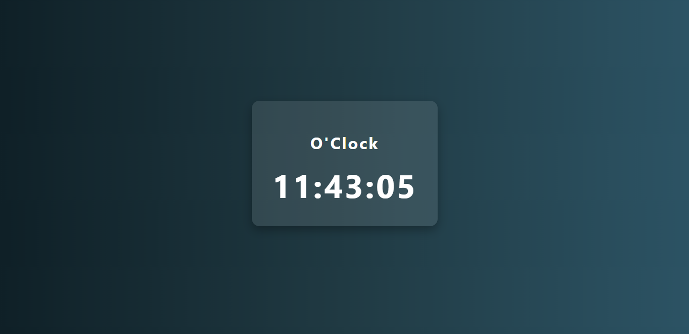

baca aku dulu ya...

✅ Penjelasan Proyek Jam Digital
HTML digunakan untuk membuat kerangka proyek atau struktur halaman web.

CSS digunakan untuk mendekorasi tampilan, seperti warna, ukuran font, dan tata letak.

JavaScript (JS) digunakan untuk menambahkan interaksi, terutama untuk mengatur timer atau jam digital agar bisa berjalan secara real-time.

